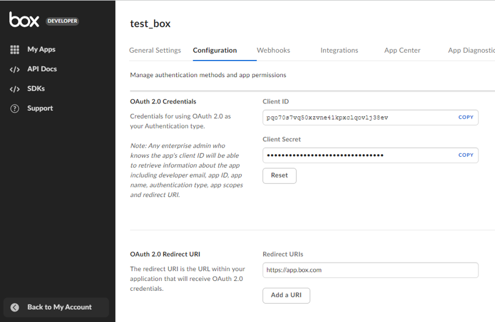
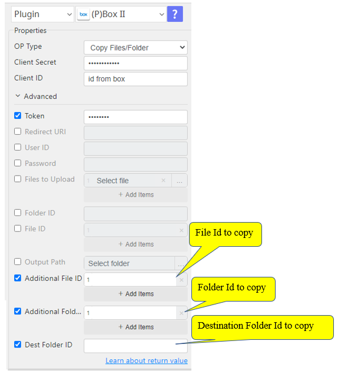
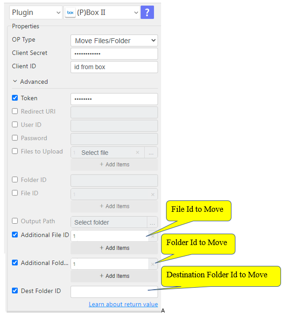
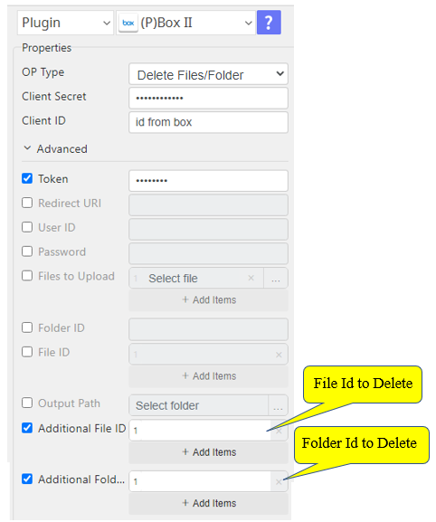
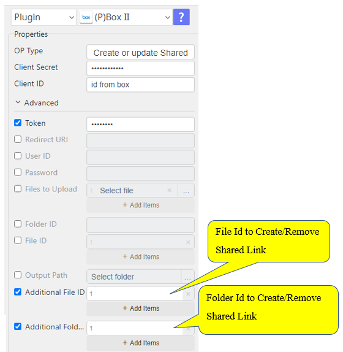

# Box II

***This plugin allows generating token from box, show list of files, upload files to box and download files from box.***

## Box II
| Item         |          Value           |
|--------------|:------------------------:|
| Icon         |  |
| Display Name |        **Box II**        |

## Arun Kumar (ak080495@gmail.com)

Arun Kumar
* [email](mailto:ak080495@gmail.com) 
 
## Version Control 
* [4.913.1342](setup.yaml)
* Release Date: `September 13, 2022`

## Primary Features
Get the file/folder lists, upload and download the files from BOX

## Create credentials from Box console

1. Create apps in here: https://account.box.com/login?redirect_url=%2Fdevelopers%2Fconsole

2. Get the Client id, Client Secret and Redirect URI to get a token

<ul>
    <li>Redirect URI not change during access.</li>
    <li>Redirect URI should be static or non hosted.</li>
    <li>Redirect URI must response quick.</li>
    <li>These Redirect URI should help.</li>
    Eg:- https://www.google.com, https://example.com, http://app.mybox.com
</ul>

## Input (Required)
| Display Name                 | Selection                           | Default Value          |
|------------------------------|-------------------------------------|------------------------|
| Get Token                    | Client ID, Client Secret            | Token (str)            |
|                              | Redirect URI                        |                        |
|                              | User ID                             |                        |
|                              | Password                            |                        |
| File/Folder Lists            | Client ID, Client Secret            | type,id,name           |
|                              | Token                               |                        |
|                              | Folder ID                           |                        |
| Upload Files                 | Client ID, Client Secret            | name,id                |
|                              | Token                               |                        |
|                              | Files to Upload                     |                        |
|                              | Folder ID                           |                        |
| Download Files/Folder        | Client ID, Client Secret            | (Downloaded file path) |
|                              | Token                               |                        |
|                              | Folder ID or File ID                |                        |
|                              | Output Path                         |                        |
| Copy Files/Folder            | Client ID, Client Secret            | name,id                |
|                              | Token                               |                        |
|                              | Additional Folder ID or/and File ID |                        |
|                              | Destination Folder ID               |                        |
| Move Files/Folder            | Client ID, Client Secret            | name,id                |
|                              | Token                               |                        |
|                              | Additional Folder ID or/and File ID |                        |
|                              | Destination Folder ID               |                        |
| Delete Files/Folder          | Client ID, Client Secret            | id deleted.            |
|                              | Token                               |                        |
|                              | Additional Folder ID or/and File ID |                        |
| Create or update Shared Link | Client ID, Client Secret            | id,link                |
|                              | Token                               |                        |
|                              | Additional Folder ID or/and File ID |                        |
| Remove Shared Link           | Client ID, Client Secret            | id remove              |
|                              | Token                               |                        |
|                              | Additional Folder ID or/and File ID |                        |

## Return Value

### Normal Case
Description of output result

## Return Code
| Code | Meaning                      |
|------|------------------------------|
| 0    | Success                      |
| 1    | Failure (Invalid Input Type) |
| 99   | Exceptional case             |

## Output Format
You may choose one of 3 output formats below,

<ul>
  <li>String (default)</li>
  <li>CSV</li>
  <li>File</li>
</ul>  

## Parameter setting examples (diagrams)

## Operations

### Get Access Token:

### File/Folder Lists:

### Upload Files:

### Download Files/Folder:

### Copy Files/Folder:

### Move Files/Folder:

### Delete Files/Folder:

### Shared_Link Files/Folder:

